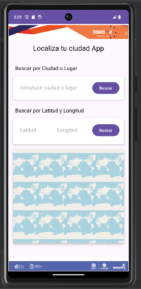
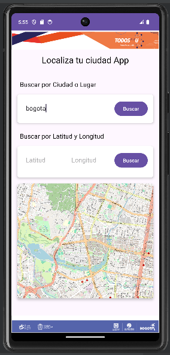
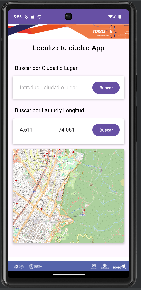

# Aplicación de Mapas con OpenStreetMap

Esta es una aplicación de Android que utiliza la biblioteca OpenStreetMap para mostrar un mapa interactivo y permitir a los usuarios buscar ubicaciones por nombre o coordenadas.

## Funcionalidades

- **Búsqueda por nombre de ubicación**: Permite a los usuarios buscar una ubicación ingresando su nombre en un campo de texto y luego muestra esa ubicación en el mapa.

- **Búsqueda por coordenadas**: Los usuarios pueden buscar una ubicación ingresando sus coordenadas de latitud y longitud y luego visualizar esa ubicación en el mapa.

## Capturas de Pantalla

### Pantalla de Inicio

### Búsqueda por Nombre de Ubicación

### Búsqueda por Coordenadas

## Instalación

Para probar esta aplicación, puedes clonar este repositorio y abrirlo en Android Studio. Asegúrate de tener configurado el entorno de desarrollo de Android y las dependencias necesarias.

